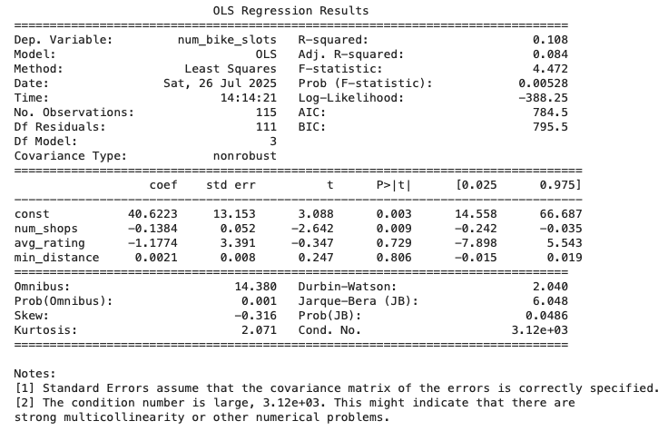

# Final-Project-Statistical-Modelling-with-Python

## Project/Goals

The goal of this project was to investigate whether the number of bike slots across the city of Dublin, Ireland showed any statistical relationship with characteristics of nearby coffee shops. Data on bike stations (including their coordinates and total number of slots) was pulled from the CityBikes API, which provides detailed information on bike‑share networks. That data was then paired with coffee shop details from the Yelp and Foursquare APIs. These APIs offered information such as each shop’s name, its rating, and its distance from a given station. Once the datasets were combined, the focus was on looking for patterns between the number of bike slots and a few specific metrics about nearby coffee shops:

* Dependent Variable
	* Total number of bike slots at each station.

* Independent Variables
	* The average rating of coffee shops within 350 meter of each station.
	* The number of coffee shops within that same 350 meter radius.
	* The minimum distance to the closest coffee shop.

The purpose of this analysis was to see if there are any measurable relationships between bike station slot counts and nearby coffee shop metrics. It wasn’t about proving any kind of cause and effect — just exploring the data to see if any interesting connections might emerge.

## Process

### Step 1: Data Collection

Data on bike stations, including latitude, longitude, and total slot counts, was retrieved from the CityBikes API. For each station location, additional information on nearby coffee shops was gathered from both the Yelp and Foursquare APIs, which provided attributes such as shop names, ratings, and distances from each station. One important limitation was that each API call could return a maximum of 50 venues. In a dense urban area like Dublin, a larger search radius (such as 1000 meters) would often exceed this limit and consistently return the maximum 50 venues, which would not accurately represent the true density around each station. To address this and maintain a more meaningful dataset, the search radius was reduced to 350 meters. This smaller radius allowed the data to better reflect the immediate surroundings of each bike station without repeatedly hitting the API’s upper limit.

Data from Yelp and Foursquare were then compared. Yelp was ultimately selected as the primary data source because it produced a larger number of records per station and included more detailed attributes for each coffee shop, such as ratings, providing more meaningful context for analysis.

### Step 2: Data Cleaning

Before combining the datasets, the raw coffee shop data retrieved from the APIs was first cleaned to ensure its quality and reliability. The data was checked for duplicate entries and missing values, and key fields were reviewed to confirm that they made sense in context. For example, the distance and rating fields were examined, and it was identified that approximately 450 records, which was about 11% of the coffee shop data, contained a rating of 0. Since Yelp’s review system operates on a 1–5 scale, a rating of 0 indicated that these shops had never been rated by customers. To prevent these records from skewing the analysis, only coffee shops with ratings of 1 or higher were retained.

Once the dataset was cleaned, three key metrics were calculated for each bike station area based on the filtered coffee shop data:

* The count of coffee shops within a 350‑meter radius.
* The minimum distance from the bike station to the closest coffee shop.
* The average rating of all coffee shops within that radius.

### Step 3: Data Combination

After collecting and cleaning the datasets, the next step was to integrate the information from the CityBikes API with the coffee shop data obtained from the Yelp API. This involved joining the two datasets based on matching latitude and longitude coordinates for each bike station. The result was a consolidated dataset where every bike station record included its total number of bike slots, the count of shops within 350 meters, the average rating of those shops, and the minimum distance to the closest one. This combined dataset served as the foundation for all subsequent analysis and modelling.

### Step 4: Exploratory Data Analysis

Exploratory data analysis was carried out to visually examine potential relationships between the variables. Scatter plots were created to compare the dependent variable (i.e. the total number of bike slots at each station) against each of the independent variables (i.e. the number of coffee shops, the minimum distance to a coffee shop, and the average rating of nearby coffee shops). These plots were used to look for any visible trends, patterns, or correlations that might indicate a relationship between bike station slot counts and the surrounding coffee shop metrics before proceeding to formal modelling.

### Step 5: Data Modelling

After completing the exploratory analysis, a multivariate regression model was applied to test for any statistical relationships between the dependent variable and the selected independent variables. This step provided a formal way to evaluate whether the coffee shop data could explain variations in bike slot counts, moving beyond visual exploration to a quantitative assessment.

## Results

The multivariate regression analysis produced the following outcomes:

* The overall model was statistically significant (F‑statistic p‑value = 0.00528), but it explained only a small portion of the variation in bike slot counts. The R‑squared value was 0.108, and the adjusted R‑squared was 0.084, meaning the independent variables together explained about 8.4% of the variation in the number of bike slots.

* Among the three independent variables, only num_shops (the number of nearby coffee shops) showed a statistically significant relationship with bike slots (p = 0.009). The coefficient for num_shops was –0.1384, indicating that for each additional coffee shop within the 350‑meter radius, the model predicts a very slight decrease of approximately 0.14 bike slots at that station.

* The other variables, avg_rating (coefficient = –1.1774, p = 0.729) and min_distance (coefficient = 0.0021, p = 0.806), were not statistically significant, as their p‑values were well above 0.05.

* Scatter plots created during the exploratory analysis phase did not reveal any visible linear relationships between bike slots and any of the coffee shop metrics.

(./images/EDA_01.png)

(./images/EDA_02.png)

(./images/EDA_03.png)

## Challenges 
(discuss challenges you faced in the project)

## Future Goals
(what would you do if you had more time?)
