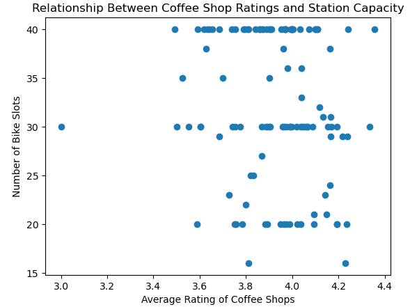
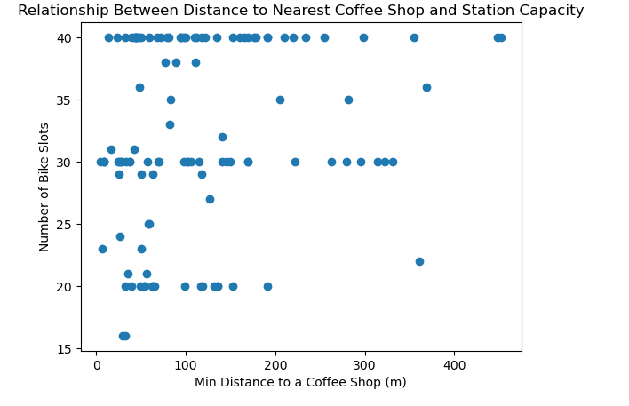
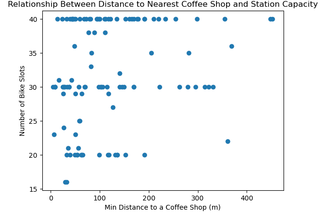

# 🚲 CityBikes Dublin — Statistical Modelling Project

## 📌 Project Goals

The goal of this project was to investigate whether the number of **bike slots** across the city of **Dublin, Ireland** showed any statistical relationship with characteristics of nearby **coffee shops**.  

Data on bike stations (coordinates + total slots) was pulled from the **CityBikes API**, while coffee shop details came from **Yelp** and **Foursquare APIs**. These APIs provided shop names, ratings, and distances from stations.  

Once combined, the focus was on exploring patterns between **bike slots** and the following **coffee shop metrics**:  

- 🎯 **Dependent Variable**  
  - Total number of bike slots at each station  

- 📊 **Independent Variables**  
  - Average rating of coffee shops within 350m  
  - Number of coffee shops within 350m  
  - Minimum distance to the closest coffee shop  

The purpose of this analysis was **not causal inference**, but rather to explore whether interesting connections exist between station capacity and nearby coffee shop characteristics.  

---

## 🛠️ Process

### 🔎 Step 1: Data Collection
- Retrieved bike station data (**latitude, longitude, slot counts**) from **CityBikes API**  
- Gathered nearby coffee shop data from **Yelp** and **Foursquare APIs** (names, ratings, distances)  
- Managed **API limitations** (max 50 venues per call) by reducing search radius from **1000m → 350m** for a more accurate reflection of station surroundings  
- Selected **Yelp** as the primary data source (more records + detailed attributes, especially ratings)  

---

### 🧹 Step 2: Data Cleaning
- Checked for **duplicates** and **missing values**  
- Reviewed key fields (distance, ratings) for accuracy  
- Removed ~450 shops (~11% of data) with rating = 0 (unrated in Yelp’s 1–5 scale)  
- Calculated for each station:  
  - ☕ Count of coffee shops within 350m  
  - 📏 Minimum distance to the closest shop  
  - ⭐ Average rating of shops in that radius  

---

### 🔗 Step 3: Data Combination
- Integrated **bike station dataset** with **Yelp coffee shop dataset**  
- Performed joins using **latitude & longitude**  
- Created consolidated dataset with:  
  - Total bike slots  
  - Number of coffee shops within 350m  
  - Average shop rating  
  - Distance to closest shop  

---

### 📊 Step 4: Exploratory Data Analysis
- Built **scatter plots** to compare bike slots with:  
  - Number of coffee shops  
  - Minimum distance to nearest shop  
  - Average shop rating  
- Checked for visible patterns or correlations prior to statistical modelling  

---

### 📉 Step 5: Data Modelling
- Applied a **multivariate regression model**  
- Tested relationships between bike slots and independent coffee shop variables  
- Quantified whether coffee shop data could explain variations in bike station sizes  

---

## 📈 Results

- 📌 The regression model was **statistically significant** (p = 0.00528), but explained little variation (R² = 0.108, Adj. R² = 0.084 → ~8.4% variance explained)  
- ☕ **Number of nearby coffee shops** was statistically significant (p = 0.009) with a slight **negative coefficient (–0.1384)** → Each extra shop predicted ~0.14 fewer slots. Effect size is negligible in practice.  
- ⭐ **Average rating** (p = 0.729) and 📏 **minimum distance** (p = 0.806) were **not significant**  
- Scatter plots showed **no clear linear relationships**  

#### 📊 Scatter Plot Diagrams
  
  
  

#### 📑 Multivariate Regression Summary
  

---

## ⚡ Challenges
- ⛔ **API limits**: max 50 results → reduced search radius to 350m  
- ⚠️ **Data quality**: ~11% shops had rating = 0 → removed to improve averages  
- 🔗 **Data integration**: Merging APIs by coordinates required careful handling  
- 📉 **Weak regression power**: Variables explained little variance in bike slots  

---

## 🚀 Future Goals
- ➕ Add other **points of interest** (parks, schools, restaurants) for stronger explanatory power  
- ⏰ Conduct **time-based analysis** → e.g., morning vs. evening usage near coffee clusters  
